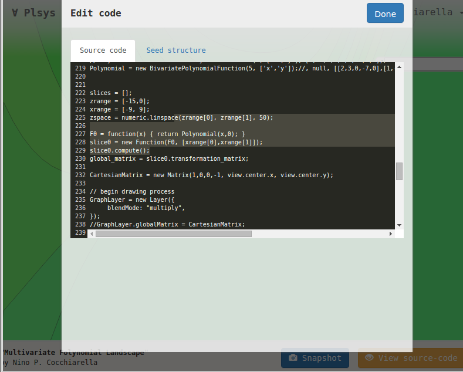
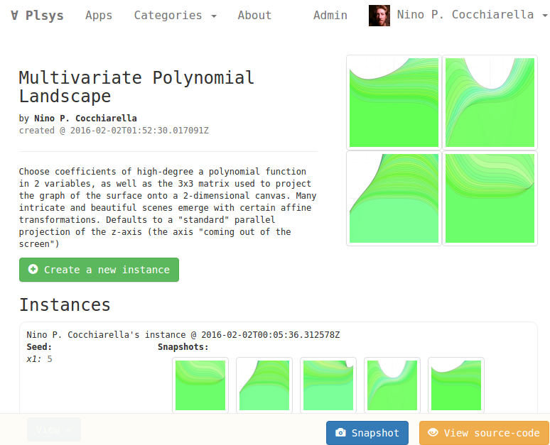
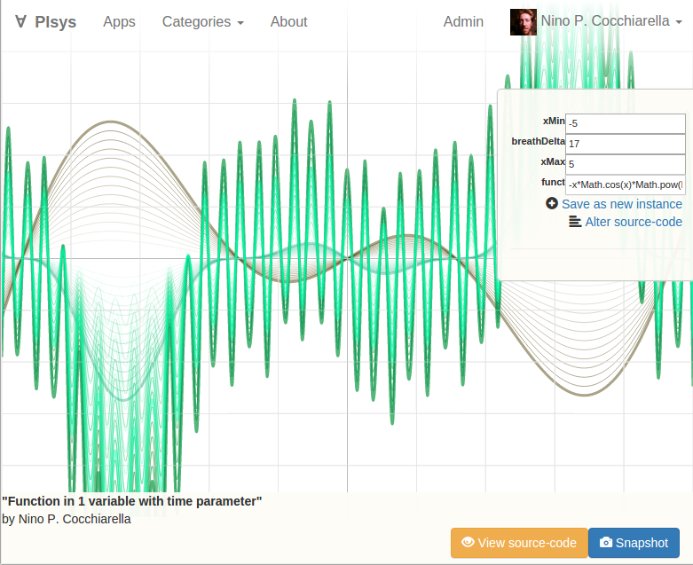
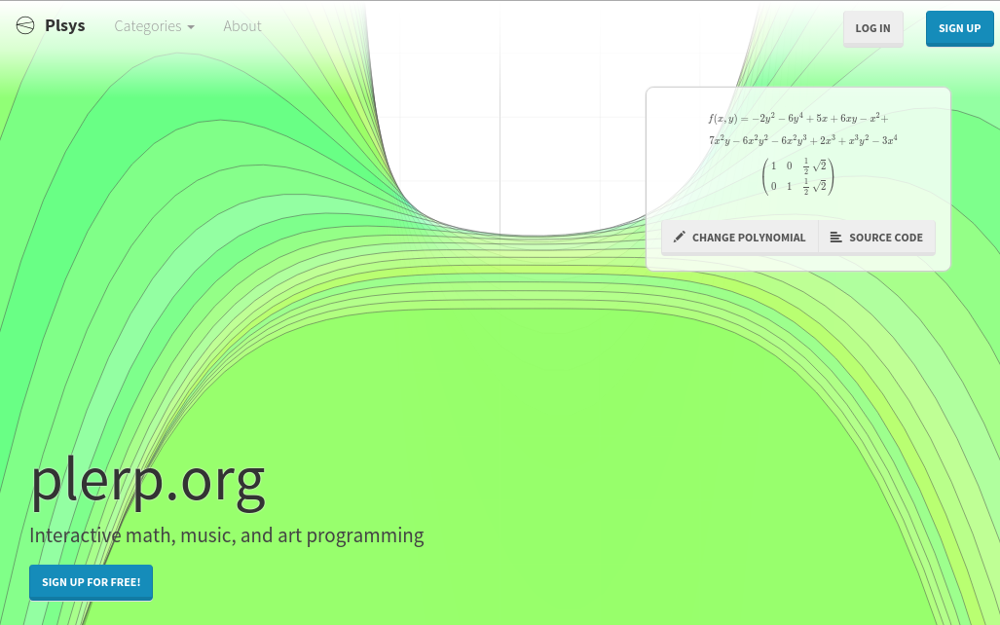
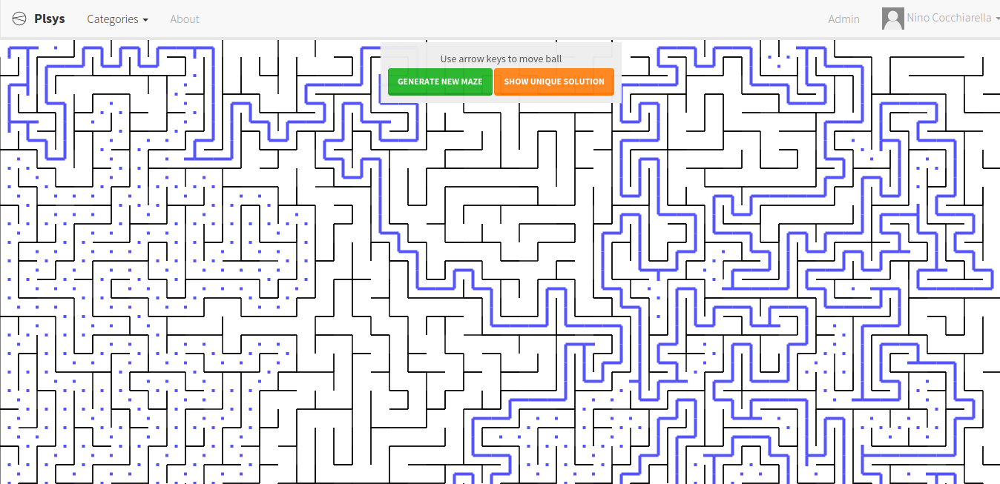

# ∀aa∃ #
## Apps at an Exhibition ##

*"Interactive math, music, and art programming"*

*∀aa∃* is intended as an experiment intended to become a new platform for artistic expression and research.  Based on the concept of users creating and publishing apps that render onto the HTML5 canvas -- an *∀aa∃* app is meant to be a mathematical "space", in that the creator must choose certain variables as paramaters, the varying of which should produce wildy different, unexpected, and hopefully someutimes quite beautiful results.  

- An *∀aa∃* app with even 3-5 par amater-variables can yield a vector space that is so immense that even an algorithm cannot reasonably enumerate all possible outcomes.

- An *∀aa∃* app should be based, as far as is practical, on purely mathematical "drawing", most importantly fractals and chaotic functions, as these are the type that will produce the most striking and unexpected results.

- Once a user publishes their *∀aa∃* app, other users may experiment with simply varying the parameters and observing the strange, beautiful, or very possibly quite ugly and pointless results.  Only a human mind can look at a new "instance" derived from an app and proclaim that it is either "art", or it is "not art".  Ideally, users will save their instances of other's apps that they believe are art of some kind, or, in other words, just "look cool".  When the "cool" vectors in a set of parameters are found, this should begin to illuminate which "spots" in the n-dimentional vector space of the app "where it's at", and so on.

- An *∀aa∃* is forbidden to use the `Math.random()` function at all.  This ensures the mathematical purity of the results, enforcing that the actual pure mathematics shine as just what they are, in the purest state.

