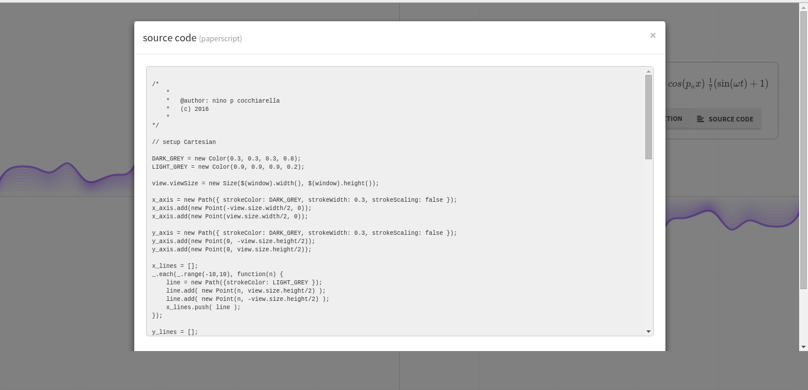
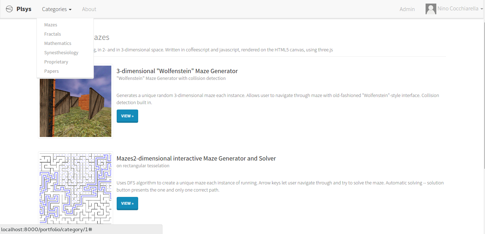

##plerp.org##
*"Interactive math, music, and art programming"*

Plerp.org is a project planned in two phases. The current site is the first phase, and it serves as a portfolio for its creator.

In a broader sense, plerp.org aims to lay the foundation of "sysnesthesiology", the creator's own term for his inter-disciplenary research. The mission of plerp.org, and of sysnesthesiology in general, is to discover connections between mathematics, music, logic, art, and philosophy. More technically, sysnesthesiology is the study of mathematical "mappings" between categories (abstract algebraic structures) that we percieve through different sensory channels. For example, visualizing music in real-time as animated graphic images would be an isomorphism from the category of musical sound and the category of pixels on screen over time.

## Dependencies

To setup and run the sample code, you're going to need `npm` from NodeJS available to install the frontend code.

## Setup

You're encouraged to setup a `virtualenv` to work in prior to configuring the dependencies.

1. Install Python Requirements

        pip install -r requirements.txt
        python setup.py develop

2. Install Bower + Grunt

		npm install -g grunt-cli bower

3. Install Assets

        npm install
        bower install

4. Compile Assets

        grunt

